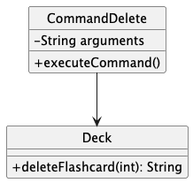
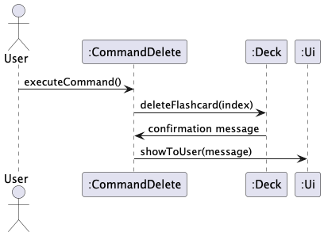
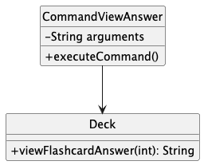
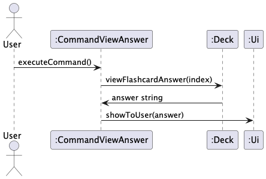
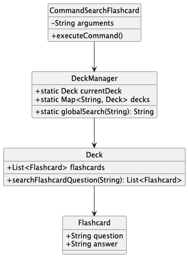
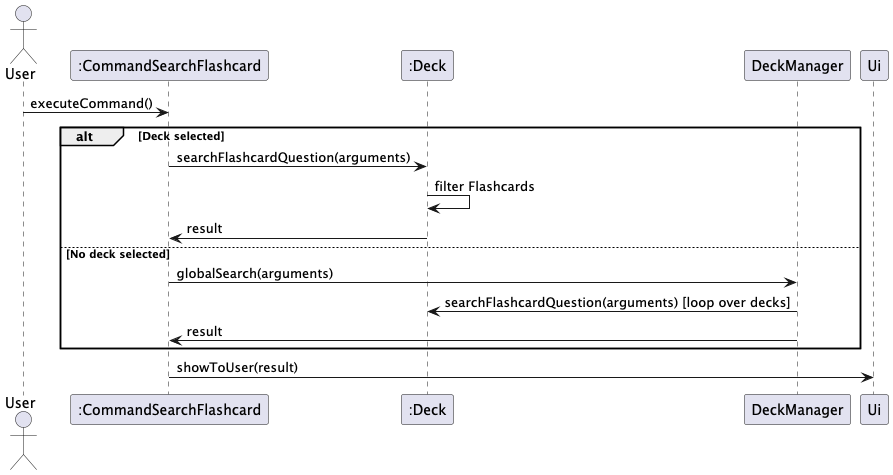
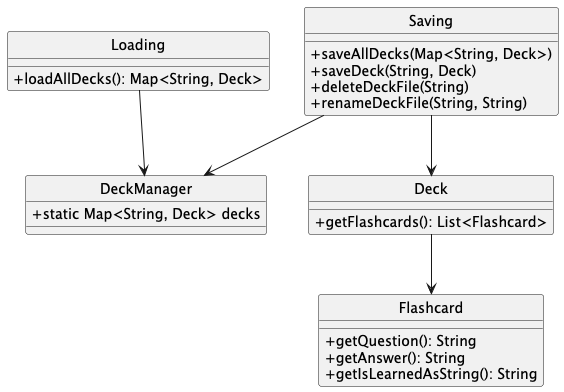
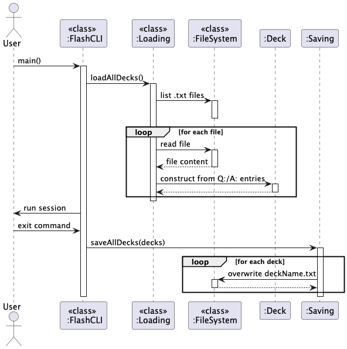

# Wong Man Zhong - Project Portfolio Page

## Project: FlashCLI
## Overview
FlashCLI is a command-line flashcard application designed specifically for CS2113 Software Engineering students. It helps students create, manage, and review flashcards efficiently, making it easier to retain important concepts in Java, software design, and coding best practices.

Given below are my contributions to the project
### Summary of Contributions
- **New Feature**: Added the ability to search for a specific flashcard.
    - What it does: Allows the user to search for flashcards based on either the question or answer or both.
      The search will be automatically global if no deck is selected and local to the deck if one is selected.
    - Justification: This feature improves the product significantly because a user can access specific flashcards
      that is relevant to a specific query they have in mind without going through all the decks/flashcards.
      This provides a quick and convenient way to look for flashcards.
    - Credits: ChatGPT for LinkedHashMap handling for global search function
- **New Feature**: Added the ability to save and load flashcard decks.
    - What it does: Saves the decks and flashcards created into a directory.
      Upon startup, the program will extract the saved decks and flashcards from the directory for the user to manipulate
      inside the program. Each deck is saved as its own .txt file. Deleted decks will likewise have their file deleted upon exit.
    - Justification: This feature improves the product significantly as a user can now retain the decks and flashcards created
      even after closing the program. This allows the user to build off created decks instead of starting from scratch each time.
      This also facilitates sharing of decks between users to enhance the learning experience.
    - Credits: CS2113 iP for introducing saving and loading methods.
- **New Feature**: Added the ability to delete flashcards from a deck.
    - What it does: Removes the flashcard from the deck based on index. This action cannot be undone.
    - Justification: This feature improves the product by allowing the users to remove outdated content or flashcards created by mistake.
      This keeps each deck concise and updated, instead of being cluttered with unnecessary information.

- **New Feature**: Added the ability to view the answer to a specific flashcard.
    - What it does: Shows the answer to the flashcard based on index.
    - Justification: This feature enhances the usability of the application by allowing users to check specific answers
      without starting a full review or quiz session.
      It supports targeted learning by enabling quick recall and revision of particular concepts,
      which is especially useful when clarifying doubts or revisiting difficult questions.

- Wrote JUnit tests for all features listed above.
- Code contributed: [RepoSense link](https://nus-cs2113-ay2425s2.github.io/tp-dashboard/?search=manz9802&breakdown=true&sort=groupTitle%20dsc&sortWithin=title&since=2025-02-21&timeframe=commit&mergegroup=&groupSelect=groupByRepos&checkedFileTypes=docs~functional-code~test-code~other)
- **Documentation:**
    - User Guide:
        - Added documentation for the features `search`, `delete` and `ans` [#67](https://github.com/AY2425S2-CS2113-F11-4/tp/pull/67)
    - Developer's Guide:
        - Added implementation details for the `search`, `delete`, `ans` and save/load feature. [#59](https://github.com/AY2425S2-CS2113-F11-4/tp/pull/59)
        - Added Product Scope in the appendix. [#59](https://github.com/AY2425S2-CS2113-F11-4/tp/pull/59)
- **Community:**
    - Reported bugs [#67](https://github.com/AY2425S2-CS2113-F11-4/tp/pull/67) [#60](https://github.com/AY2425S2-CS2113-F11-4/tp/pull/60)
    - Reported 9 bug in other team's tP.
    - Gave structured feedback for other team's DG.

<div style="page-break-before: always;"></div>

## Contributions to User Guide

### View answer only: `ans`
Show the answer of a flashcard via its index.

Format: `ans INDEX`
INDEX must be a positive integer, ie: 1, 2, 3
Examples:
```
[INPUT]: ans 3
[OUTPUT]:
Answer of flashcard 3
Answer: Java
```
### Delete flashcard: `delete`
Delete the flashcard in the deck via its index

Format: `delete INDEX`
INDEX must be a positive integer, ie: 1, 2, 3
Examples:
```
[INPUT]: delete 3
[OUTPUT]:
Deleted flashcard 3
Question: What language is used in CS2113?
Answer: Java
```
### Search Flashcards: `search`
Searches for the specified flashcard. If no deck is selected, the search will be across all decks.
However, if a deck is selected, then the search will only be specific to that deck.

Format: `search /q QUESTION /a ANSWER` either /q or /a can be omitted if required. Non-case specific.

Examples:
```
[INPUT]: search /q What language is used in CS2113? /a Java
[OUTPUT]: 
Flashcards matched: 
Deck: CS2113
Question: What language is used in CS2113?
Answer: Java
[INPUT]: select CS2113
[INPUT]: search /q What language is used in CS2113?
[OUTPUT]: 
Flashcards matched: 
Question: What language is used in CS2113?
Answer: Java
[INPUT]: search /a java
[OUTPUT]: 
Flashcards matched: 
Question: What language is used in CS2113?
Answer: Java
```
<div style="page-break-before: always;"></div>

## Contribution to Developer Guide
### 3.1.3. Delete a flashcard

#### Design

The delete flashcard feature allows users to remove a specific flashcard from the currently selected deck based on index. The system validates the index and ensures it’s within bounds.

#### Class Diagram



#### Sequence Diagram



#### Implementation

##### `Deck#deleteFlashcard(int index)`

- Removes the flashcard at the given index
- Returns a confirmation message with the deleted flashcard's content

##### `CommandDelete#executeCommand()`

- Parses the index from user input
- Validates it as a number and within bounds
- Invokes `deleteFlashcard(...)`
- Displays confirmation or appropriate error messages

**Edge Cases Handled:**
- Invalid input format (e.g., not an integer) → `NumberFormatException`
- Index out of bounds → `ArrayIndexOutOfBoundsException`

### 3.1.4. View a flashcard answer

#### Design

This feature enables the user to view the answer to a specific flashcard by supplying its index. It assumes the user has already selected a deck.

#### Class Diagram



#### Sequence Diagram



#### Implementation

##### `Deck#viewFlashcardAnswer(int index)`

- Returns the answer text of the flashcard at the given index

##### `CommandViewAnswer#executeCommand()`

- Parses the index
- Validates that it's a valid number and within bounds
- Retrieves and displays the answer

### 3.2.7. Searching

#### Design

The flashcard application supports searching for flashcards either within the currently selected deck or globally across all decks.

The search feature is designed with the following constraints:

- Users may search by question (`/q`) and/or answer (`/a`)
- If no deck is selected, the search is performed globally across all decks
- If a deck is selected, only that deck is searched
- The system is case-insensitive and supports partial matches

##### Class Diagram

The following PlantUML diagram shows the key classes involved in the search operation:



##### Sequence Diagram

Below is a simplified sequence of how a search request is handled:



#### Implementation

##### `Deck#searchFlashcardQuestion(String arguments)`

This method parses the search arguments for `/q` and `/a` prefixes and returns flashcards that match either (or both) the question or answer. It supports edge cases such as:

- Only `/q` or only `/a` provided
- Input in any order (`/a first /qsecond` works too)
- Case insensitivity

The method throws a `FlashCLIArgumentException` if neither `/q` nor `/a` is present.

```java
String queryQuestion = ...; // parsed from arguments
String queryAnswer = ...;   // parsed from arguments
for (Flashcard f : flashcards) {
  boolean matches = ...;
  if (matches) matched.add(f);
}
return matched;
```

##### `DeckManager#globalSearch(String arguments)`

This method iterates through all decks in `DeckManager.decks`, calls `deck.searchFlashcardQuestion()`, and returns a formatted string of results including the deck name, question, and answer.

**Edge cases handled:**
- No decks exist → `EmptyListException`
- Malformed arguments → `FlashCLIArgumentException`
- No matches → returns `"No matching flashcards found in any deck."`

##### `CommandSearchFlashcard`

This command bridges user input with search logic:

- If `DeckManager.currentDeck == null`, invokes `DeckManager.globalSearch()`
- Otherwise, calls `Deck.searchFlashcardQuestion()`
- Sends output to `Ui.showToUser(...)`

#### Considerations & Limitations

- Currently does not support regex or fuzzy matching
- Could be extended to highlight matched terms or paginate long results
- Error handling is gracefully propagated to the UI layer

### 3.2.8. Save/Load Functionality

#### Design

The Save/Load functionality ensures persistence of flashcard data between sessions. When the program exits, it serializes all in-memory `Deck` objects into individual `.txt` files in the `./data/decks` directory. Upon startup, it reconstructs the decks by reading and parsing these `.txt` files.

This design allows easy access, portability, and simple debugging via text files, avoiding binary or JSON formats for simplicity.

#### Class Diagram



#### Sequence Diagram



#### Implementation

##### `Saving.saveAllDecks(Map<String, Deck>)`

- Creates `./data/decks/` directory if not present
- Removes any `.txt` files that no longer correspond to in-memory decks
- Iterates over each deck and writes its flashcards in:

```
Q: question text
A: answer text
```

Each flashcard is separated by a blank line for clarity.

**Edge cases handled:**
- Missing directory → automatically created
- Deleted decks → corresponding `.txt` files removed

##### `Loading.loadAllDecks()`

- Reads all `.txt` files in `./data/decks`
- Infers deck name from filename (e.g. `bio.txt` → deck name = `bio`)
- Parses `Q:` and `A:` pairs into `Flashcard` objects
- Adds each loaded `Deck` to a `LinkedHashMap`

**Edge cases handled:**
- Non-existent or empty folder → returns empty deck map
- Files with missing/partial questions/answers → skipped or handled gracefully

##### `FlashCLI.main()` Integration

```java
DeckManager.decks = Loading.loadAllDecks();
...
Saving.saveAllDecks(DeckManager.decks);
```

- Loads decks at startup
- Saves them at exit, after user types the `exit` command

#### Considerations

- File format is human-readable and editable
- Current implementation assumes well-formed files
- Future improvements: introduce backup/restore, encryption, or support for import/export formats like JSON/CSV
